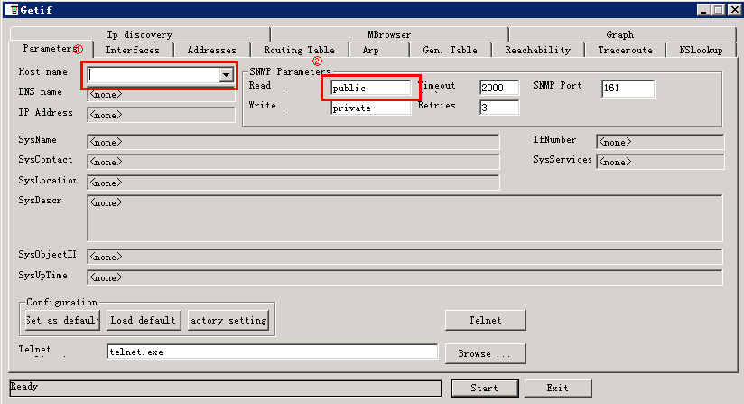
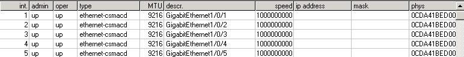
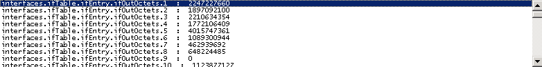
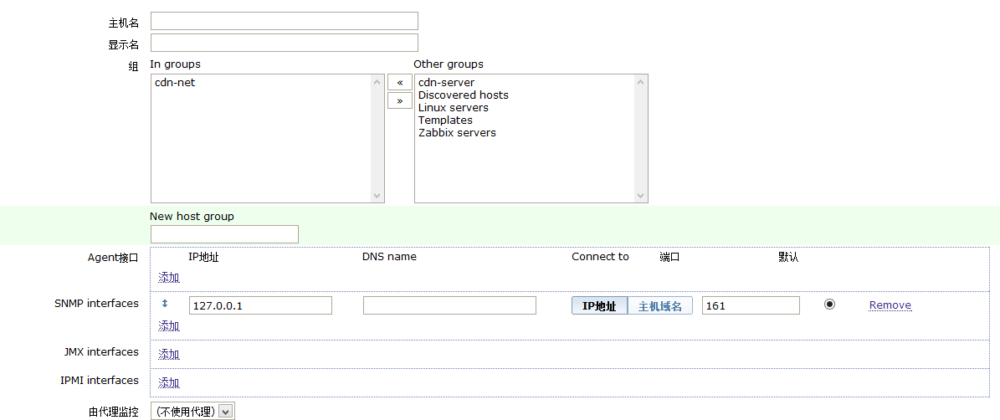

前一阵我们想用zabbix监控交换机网卡出口流量，下面和大家一并分享下实现方法。    

>1）假设我们想获取交换机出口流量，则需要先找到该接口出口字节数所对应的OID。为什么不直接找交换机出口流量？因为我们找来找去实在是在不到直接表明出口流量的OID，只能找到该出口字节数所对应的OID。那么如何获取OID？通过MIB浏览器可以获取到相应交换机接口流量属性的OID。我们使用getif这个软件来获取交换机OID，下面是这个软件官网链接，有兴趣的朋友可以下载试用一下。   

[http://www.wtcs.org/snmp4tpc/getif.htm](http://www.wtcs.org/snmp4tpc/getif.htm)

>2）在填写好SNMP参数后，点击start，来完成对交换机OID的获取。在interface选项卡，可以查看到交换机接口。     

   

>3）选择你要监控的端口记下端口对应的int字段，然后点击MBrowser。OID成树状结构（TCP/IP详解卷一有详细介绍），依次选择iso->org->dod->internet->mgmt->mib-2->interface->ifTable->ifEntry->ifOutOctets。    

   

>interfaces.ifTable.ifEntry.ifOutOctets后接的数字表明交换机接口，根据在interface选项卡中找到的int值，可以在这里查看当前交换机该端口传输出的字节数，进而通过该字节数计算出该口的流量，同时我们也可以获得该接口的OID值。   

    

>4)当我们找到要监控接口流量OID后，下面进入zabbix，在zabbix里新建主机，其中选择SNMP interfaces，填写好IP地址点击确定。    

    

> 5）在创建好一个监控主机之后，下面来创建一个监控项，在创建监控项的时候应注意，因为我们刚才查的OID是交换机接口出口字节数，因此在创建监控项时要有一些选择。    

	a）类型：SNMPv2 agent;    
	b）key:用于标识该监控项;   
	c）SNMP OID：填写上面我们找到的OID   
	d）单位：bps   
	e）Use custom multiplier：这个我们要勾选上，以为我们通过OID取到的是字节数，这里乘以8得到的才是bit    
	f）数据更新间隔：这个根据自己需要进行填写    
	g）store value:选择Delta Speed per second,因为我们监控的流量（bps），因此需要数据的增量除以时间的增量。    

>6）创建好监控项之后，在创建一个图形显示项即可完成对网卡流量的监控，在创建图形显示项时，选择我们之前创建的监控项即可。    

通过上面的方法就可以实现使用zabbix监控交换机端口出口流量，当然通过获得不同的OID也可以监控其他的。    

via [noops](http://noops.me/?p=1067)
